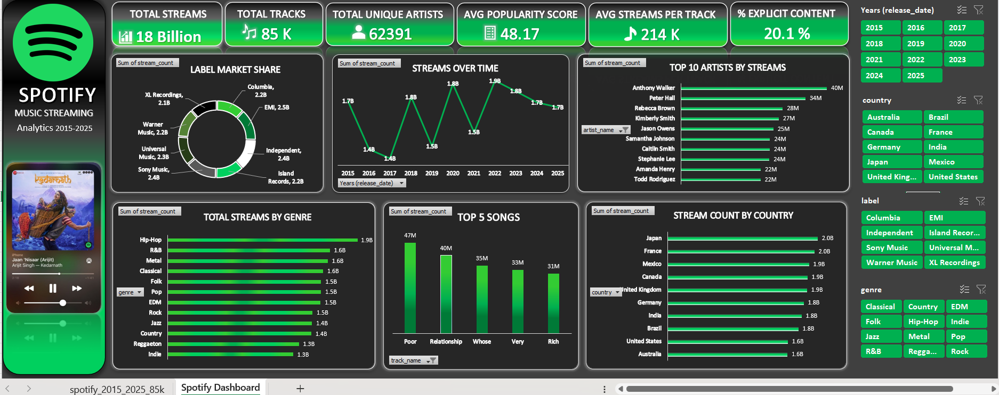

 🎧 Spotify Music Streaming Analytics Dashboard

An interactive Excel dashboard built on a dataset of 85,000 tracks (2015–2025), 
analyzing streaming trends across genres, countries, artists, and labels.

 📊 Overview
This dashboard turns raw streaming data into an interactive, presentation-ready 
report using Excel PivotTables, PivotCharts, and Slicers — styled with a 
Spotify-inspired dark theme.

 🔑 Key Features
- 6 KPI cards: Total Streams, Total Tracks, Unique Artists, Avg Popularity, 
  Avg Streams/Track, % Explicit Content
- 6 interactive charts: Streams Over Time, Top 10 Artists, Total Streams by 
  Genre, Top 5 Songs, Stream Count by Country, Label Market Share
- 4 connected slicers (Year, Country, Label, Genre) — filter all charts at once
- Spotify-branded dark UI theme

 🛠️ Tools Used
- Microsoft Excel (PivotTables, PivotCharts, Slicers, Custom Number Formatting)

 📁 Dataset
85,000 rows covering track metadata (name, artist, album, genre, release date), 
audio features (danceability, energy, tempo), and streaming performance 
(stream count, popularity, country, label).

 📸 Preview

 📈 Insights Found
- Hip-Hop leads total streams among all genres
- 2022 was the peak year for total streams
- ~20% of tracks in the catalog are explicit
- Independent labels hold a meaningful share alongside major labels

 🚀 What I Learned
- Building interactive dashboards using PivotTables and Slicers
- Connecting multiple PivotTables to shared slicers (Report Connections)
- Custom number formatting (K/M/B display)
- Dashboard design principles: color theory, contrast, layout, branding consistency

 📂 Files in this Repo
- `Spotify Music Streaming Analysis.xlsx` — full workbook (raw data + dashboard)
- `Dashboard_Preview.png` — dashboard screenshot
- `README.md` — project documentation
